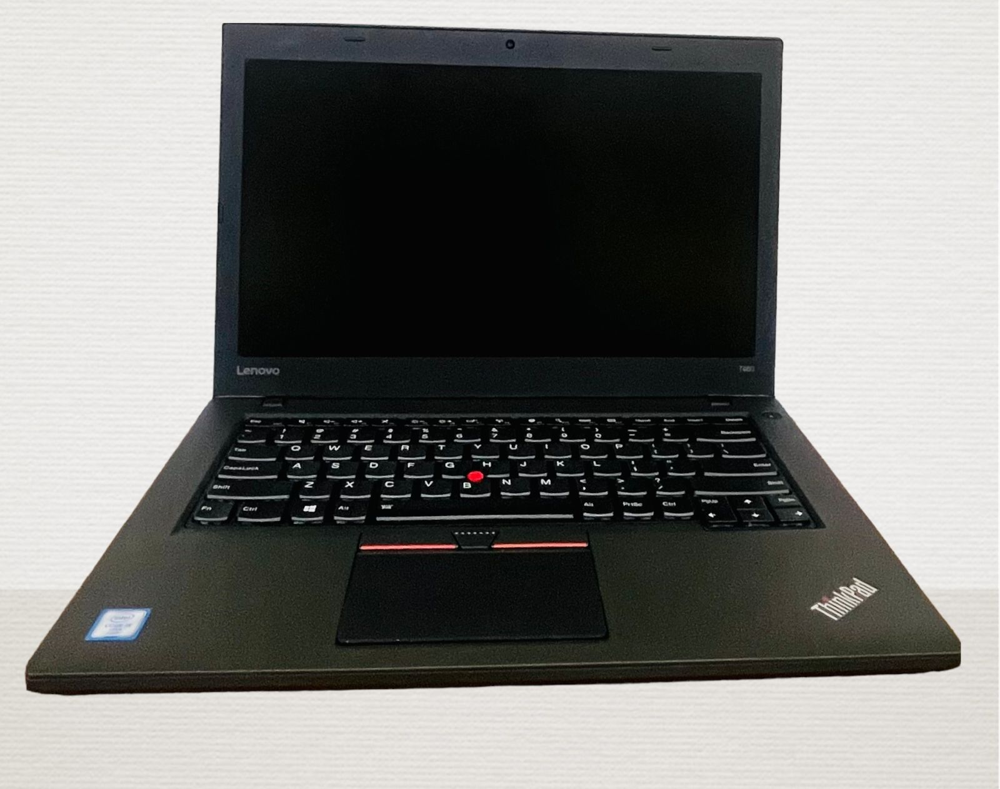

 1. Memoria USB de al menos 16GB Para no quedarnos cortos

 

2. Portátil que necesitemos formatear en mi caso sera un poderoso ThinkPad T460 corporativo. 

3. Paciencia por que puede llegar a demorar :,)