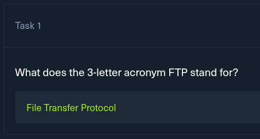
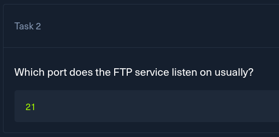

- **Nombre:** FAWN
    
- **SO:** Linux 
    
- **Dificultad:** Very Easy
    
- **IP:** `10.10.10.X`

START



📂 FTP (File Transfer Protocol)
Es el estándar para transferir archivos entre computadores en una red. Se usa principalmente para subir o descargar datos de un servidor remoto.

- **Puertos** : Funciona por los puertos **21** (Para enviar órdenes) y **20** (para mover los datos).
- **Nota de seguridad** : Por defecto, el FTP no cifra la información, lo que significa que las contraseñas viajan de forma legible si alguien intercepta la conexión. 


- El puerto por el cual FTP escucha usualmente es el puerto **21**


Así como el servicio `HTTP` tiene su versión segura que es **HTTPS**  el servicio `FTP` tiene su versión segura que es el **SFTP** la **"s"** viene de secure


El comando `ping` es un a herramienta de diagnóstico básica para comprobar si nuestro equipo está conectado a otro dispositivo o a Internet. Funciona enviando pequeños paquetes de datos a una dirección **IP** y esperando una respuesta, nos permite medir la velocidad y verificar si hay conexión.


>## 🔍 Enumeración 
>Entramos a la parte de enumeración donde de la mano de `Nmap` podremos  saber la versión de **FTP** que tiene nuestra maquina ejecutando el siguiente comando : `nmap -sV -p 21 10.129.78.182`
>	- (-sV) :   Le decimos a nmap que hable con el servicio y pregunte que programa hay y que versión es.

Resultado: 
```
❯ nmap -sV -p 21 10.129.78.182
Starting Nmap 7.95 ( https://nmap.org ) at 2026-04-14 22:29 -05
Nmap scan report for 10.129.78.182
Host is up (0.18s latency).

PORT   STATE SERVICE VERSION
21/tcp open  ftp     vsftpd 3.0.3
Service Info: OS: Unix

Service detection performed. Please report any incorrect results at https://nmap.org/submit/ .
Nmap done: 1 IP address (1 host up) scanned in 11.95 seconds
```

Y como podemos observar en la columna **Versión** encontraremos la versión del servicio **FTP** y esa la debemos de poner en la respuesta luego del texto **vsftpd**. 


Si observamos en el fragmento de texto del punto anterior justo una fila abajo de la versión que nos solicitaban esta la respuesta a esta pregunta que es un sistema **Unix**


>## ❗Tener presente
>Si tenemos instalada la shell **zsh** al ejecutar el comando toca ponerle una barra invertida para que el sistema no lo confunda (si tenemos una bash escribirlo como esta en la captura) el comando seria así : `ftp -\?` Como se evidencia en el siguiente fragmento de texto :


<details>
<summary>Ver banner de bienvenida servicio (FTP)</summary>

```bash
❯ ftp -\?
usage: ftp [-46AadefginpRtVv] [-N NETRC] [-o OUTPUT] [-P PORT] [-q QUITTIME]
           [-r RETRY] [-s SRCADDR] [-T DIR,MAX[,INC]] [-x XFERSIZE]
           [[USER@]HOST [PORT]]
           [[USER@]HOST:[PATH][/]]
           [file:///PATH]
           [ftp://[USER[:PASSWORD]@]HOST[:PORT]/PATH[/][;type=TYPE]]
           [http://[USER[:PASSWORD]@]HOST[:PORT]/PATH]
           [https://[USER[:PASSWORD]@]HOST[:PORT]/PATH]
           ...
       ftp -u URL FILE ...
       ftp -?
  -4            Only use IPv4 addresses
  -6            Only use IPv6 addresses
  -A            Force active mode
  -a            Use anonymous login
  -d            Enable debugging
  -e            Disable command-line editing
  -f            Force cache reload for FTP or HTTP proxy transfers
  -g            Disable file name globbing
  -i            Disable interactive prompt during multiple file transfers
  -N NETRC      Use NETRC instead of ~/.netrc
  -n            Disable auto-login
  -o OUTPUT     Save auto-fetched files to OUTPUT
  -P PORT       Use port PORT
  -p            Force passive mode
  -q QUITTIME   Quit if connection stalls for QUITTIME seconds
  -R            Restart non-proxy auto-fetch
  -r RETRY      Retry failed connection attempts after RETRY seconds
  -s SRCADDR    Use source address SRCADDR
  -t            Enable packet tracing
  -T DIR,MAX[,INC]
                Set maximum transfer rate for direction DIR to MAX bytes/s,
                with optional increment INC bytes/s
  -u URL        URL to upload file arguments to
  -V            Disable verbose and progress
  -v            Enable verbose and progress
  -x XFERSIZE   Set socket send and receive size to XFERSIZE
  -?            Display this help and exit
...
```

</details>


**anonymous** El usuario que permite acceder a un servidor **FTP** sin necesidad de una cuenta registrada. Cuando nos pida el usuario al conectarnos podremos tal cual **anonymous** y cuando nos pida contraseña simplemente damos presionamos la tecla **Enter** y estaremos dentro.


Como el puerto 21 esta abierto y este puerto es del servicio FTP trataremos de conectarnos con el usuario anteriormente comentado para ver si nos encontramos con esta vulnerabilidad llamada **acceso anónimo**  :

```
❯ ftp 10.129.78.182
Connected to 10.129.78.182.
220 (vsFTPd 3.0.3)
Name (10.129.78.182:hackerbolt): anonymous
331 Please specify the password.
Password: 
230 Login successful.
Remote system type is UNIX.
Using binary mode to transfer files.
ftp> 
```

Y podemos apreciar que el código que aparece luego de entrar es : **220**


Como lo había comentado anteriormente y de las primeras cosas que se debe hacer cuando se entra a alguna máquina o en este caso al servicio FTP.  Se hace para saber con que archivos y directorios contamos:


Podemos observar la Flag de esta máquina en la captura.


Para poder leer la **Flag**  lo que debemos de hacer es descargarnos el archivo a nuestra maquina local y esto se hace con el comando `get` el comando completo es :  `get flag.txt`
y cuando revisemos en el directorio desde el cual nos conectamos al servicio **FTP** podremos visualizar la **Flag** haciendo un simple **cat** al archivo


Al poner el texto que nos sale en el espacio de la **Flag** en `Hack The Box` y darle verificar nos la marcará como correcta :  


 
   


