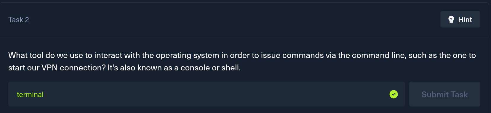
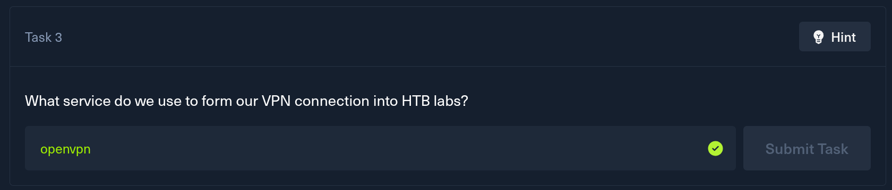
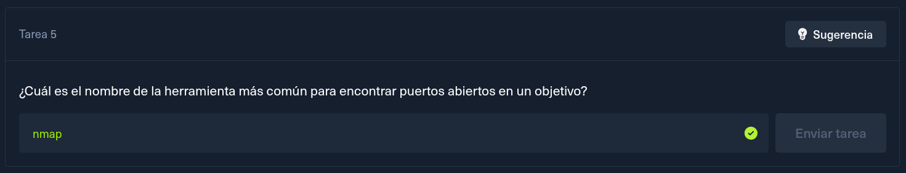
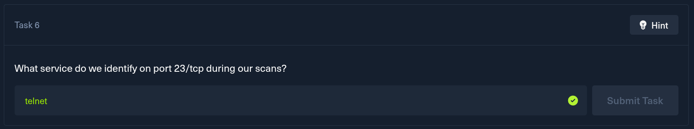
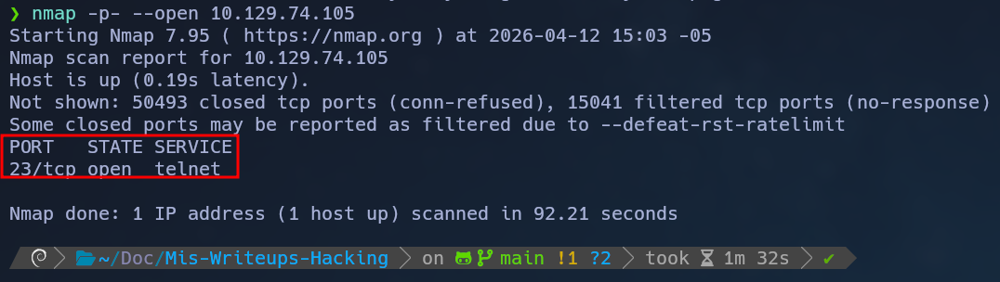

- **Nombre:** MEOW
    
- **SO:** Linux 
    
- **Dificultad:** Very Easy
    
- **IP:** `10.129.73.192`

											Start


Una `Virtual Machine` o `Maquina Virtual` en español es una emulación de un sistema operativo. En ciberseguridad, las usamos para aislar nuestro entorno de ataque evitando riesgos en  nuestro sistema anfitrión. 



La `terminal` `(o consola)` es el intérprete de comandos. A diferencia de una interfaz gráfica `(GUI)`, la terminal nos permite ejecutar herramientas de hacking que no tienen "botones", dándonos un control total y más rápido sobre el sistema.



El servicio que usamos para conectarnos a la vpn de Hack The Box es openvpn  el ejecutarlo es sencillo, estando en la carpeta donde descargamos la vpn de Hack The Box ejecutamos el comando :  `sudo openvpn nombre de la vpn` en mi caso quedaría de la siguiente manera : `sudo openvpn hackerbolt.ovpn` 

> ### ✅ Tip de Conexión
> Siempre verifica que el comando `sudo openvpn` no arroje errores de "Auth Failed".


El comando ping es una herramienta esencial de diagnostico de red para verificar la conectividad con un host remoto, medir el tiempo de respuesta (latencia) y detectar pérdida de paquetes. 



Nmap (Network Mapper) es la herramienta más importante de un pentester No solo encuentra puertos abiertos, sino que puede decirte qué versiones de software corren y hasta detectar vulnerabilidades.

> ## 🔍 Enumeración
> En la terminal, solemos usar `nmap -p- --open` para escanear los 65,535 puertos y ver solo los que están escuchando

Respuesta: 




Evidencia:




Y utilizando el comando anteriormente explicado podemos observar que en el puerto 23 tenemos escuchando el servicio de Telnet. El escaneo de los 65,535 puertos puede tardar un poco como en este caso 1 min y medio, por eso usamos `--min-rate 5000` si queremos ir más rápido.


<details>

<summary> Ver banner de bienvenida completo (Telnet) </summary>

```bash
telnet 10.129.76.116
Trying 10.129.76.116...
Connected to 10.129.76.116.
Escape character is '^]'.

  █  █         ▐▌     ▄█▄ █          ▄▄▄▄
  █▄▄█ ▀▀█ █▀▀ ▐▌▄▀    █  █▀█ █▀█    █▌▄█ ▄▀▀▄ ▀▄▀
  █  █ █▄█ █▄▄ ▐█▀▄    █  █ █ █▄▄    █▌▄█ ▀▄▄▀ █▀█


Meow login: root
Welcome to Ubuntu 20.04.2 LTS (GNU/Linux 5.4.0-77-generic x86_64)

 * Documentation:  https://help.ubuntu.com
 * Management:     https://landscape.canonical.com
 * Support:        https://ubuntu.com/advantage

  System information as of Mon 13 Apr 2026 05:17:49 PM UTC

  System load:           0.0
  Usage of /:            41.7% of 7.75GB
  Memory usage:          4%
  Swap usage:            0%
  Processes:             135
  Users logged in:       0
  IPv4 address for eth0: 10.129.76.116
  IPv6 address for eth0: dead:beef::250:56ff:fe94:1cad

 * Super-optimized for small spaces - read how we shrank the memory
   footprint of MicroK8s to make it the smallest full K8s around.

   https://ubuntu.com/blog/microk8s-memory-optimisation

75 updates can be applied immediately.
31 of these updates are standard security updates.
To see these additional updates run: apt list --upgradable


The list of available updates is more than a week old.
To check for new updates run: sudo apt update

Last login: Mon Sep  6 15:15:23 UTC 2021 from 10.10.14.18 on pts/0
root@Meow:~# 


</details>    


