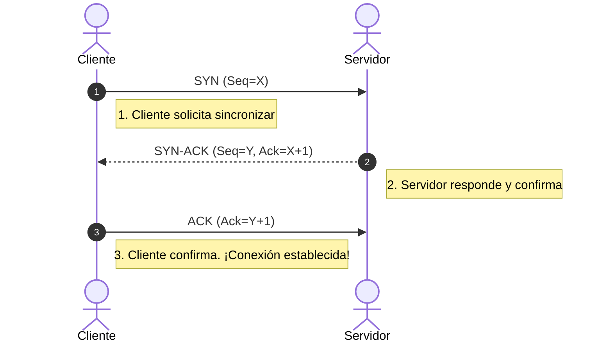

# 📊 TCP vs UDP : Diferencias Clave

| Característica | TCP (Transmission Control Protocol)                                    | UDP (User Datagram Protocol)                                 |
| :------------- | :--------------------------------------------------------------------- | :----------------------------------------------------------- |
| Conexión       | Orientado a conexión  (establece sesión antes de enviar datos).        | No orientado a conexión (envía datos sin previo aviso)       |
| Fiabilidad     | Alta : Garantiza que todos los paquetes lleguen y en el orden correcto | Baja : No garantiza la entrega ni el orden de los paquetes   |
| Velocidad      | Más lento (debido a la sobrecarga de control y confirmaciones).        | Muy rápido (sin comprobaciones, ideal para streaming/gaming) |
| Mecanismo      | Utilizan Flow Control y retransmisión de paquetes perdidos.            | Envía ráfagas de datos  (Datagramas) y se olvida.            |

# 🤝 El flujo del Three-Way Handshake (TCP)

Para que **TCP** garantice una conexión confiable, el cliente y el servidor deben sincronizarse mediante un saludo de tres vías antes de transmitir datos reales. Esto se logra usando los flags **SYN** (Synchronize) y **ACK**  (Acknowledgment) 

1. **SYN** : El cliente envía un paquete con el flag `SYN` activo y un número de secuencia aleatorio (X) para iniciar la conexión.
2. **SYN-ACK** : El servidor recibe la solicitud, activa los flags `SYN` Y `ACK`. responde con su propio número de secuencia (Y) y confirma el del cliente sumándole 1 (X + 1). 
3. **ACK** : El cliente finaliza el acuerdo enviando un paquete `ACK`, confirmando la secuencia del servidor sumándole 1 (Y + 1).

# 🔌 Puertos y Protocolos Críticos en Pentesting.

A continuación se listan los puertos más comunes identificados en las fases de escaneo          ( `Nmap`)   :

### 🔴 Puertos TCP Comunes

- **21 (FTP) :** Transferencia de archivos. Suele ser vector de ataques por fuerza bruta o credenciales por defecto que los trabajadores dejan.
- **22 (SSH) :** Gestión remota segura. Reemplaza a Telnet.
- **23 (Telnet) :** Gestión remota en texto plano (inseguro, las credenciales viajan expuestas).
- **25 (SMTP) :** Envío de correo electrónico (útil para enumeración de usuarios).
- **80 (HTTP) :** Tráfico web sin cifrar.
- **110 (POP3) :** Recepción de correos.
- **139 / 445 (SMB) :** Compartición de archivos en Windows (un objetivo clásico para exploits como EternalBlue)
- **143 (IMAP) :** Acceso a correos electrónicos.
- **443 (HTTPS) :** Tráfico web seguro con cifrado  SSL/TLS.

### 🔵 Puertos UDP Comunes

- **53 (DNS) :** Resolución de nombres de dominio a IP (puede operar en TCP para transferencias de zona).
- **67 / 68 (DHCP) :** Asignación dinámica de direcciones IP en la red.
- **69 (TFTP) :**  Versión simple de FTP sin autenticación; común para extraer configuraciones de routers o VoIP.
- **123 (NTP) :** Sincronización horaria de los dispositivos de la red.
- **161 (SNMP) :** Monitoreo de infraestructura. Si las community  strings (como `public`) están expuestas, revelan mucha información del sistema. 